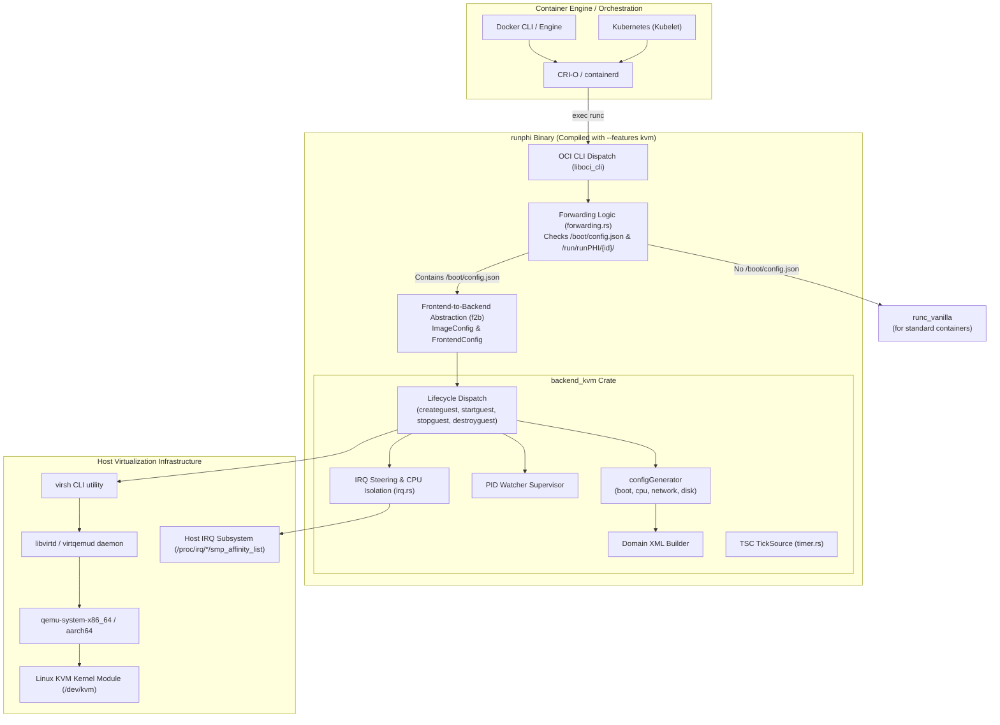
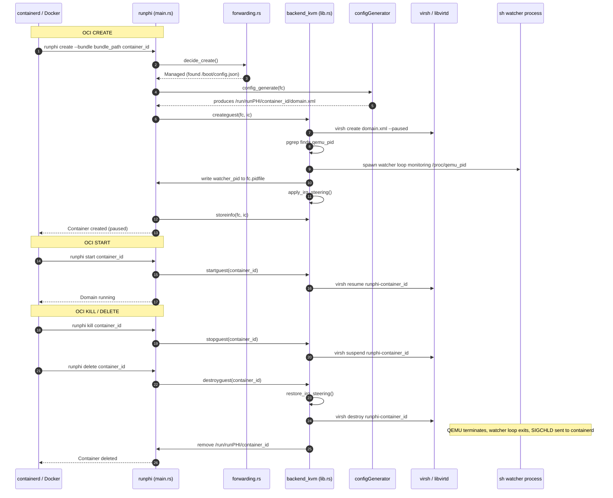

# runPHI KVM Backend — Architecture and Lifecycle

This document provides a comprehensive technical breakdown of the **KVM backend** (`backend_kvm`) in runPHI. It explains how runPHI integrates with the Linux Kernel-based Virtual Machine (KVM), Libvirt, and QEMU, details the container lifecycle state machine, explains the process supervision architecture, and describes how to set up the host environment.

---

## 1. Architectural Overview

runPHI acts as an OCI-compliant container runtime that translates standard container lifecycle operations (`create`, `start`, `kill`, `delete`, `state`) into hypervisor operations. While backends like Jailhouse target hardware partitioning and Xen targets Type-1 microkernel virtualization, **`backend_kvm`** targets standard Linux Type-2 virtualization using **KVM** and **Libvirt**.

### Layered Architecture



### Why Libvirt and `virsh`?

Rather than spawning and managing raw QEMU processes directly, `backend_kvm` leverages Libvirt and the `virsh` CLI tool:
1. **Declarative Specification**: Libvirt's Domain XML specification separates virtual machine definition from execution flags. This ensures clean, declarative configuration across different CPU architectures (`x86_64` vs. `aarch64`).
2. **Device and Bus Virtualization**: Libvirt automatically resolves device addresses, PCI bridges, virtio topologies, and console PTY allocations.
3. **Graceful Degradation**: If hardware virtualization (`/dev/kvm`) is unavailable, Libvirt easily falls back to QEMU's TCG software emulation mode without changing the runtime interface.
4. **Security Isolation**: Domains are executed under standard discretionary access controls (DAC `root:root`) with explicit lifecycle policies (`on_poweroff=destroy`, `on_reboot=destroy`, `on_crash=destroy`).

---

## 2. Host Prerequisites & Dependencies

To use runPHI with the KVM backend, the host system must meet the following hardware and software requirements:

### Hardware Requirements
- **CPU**: x86_64 with Intel VT-x or AMD-V support, or ARM64 (aarch64) with ARM Virtualization Extensions (EL2).
- **Virtualization Device**: `/dev/kvm` must exist and be accessible. (If absent, runPHI can run under QEMU TCG emulation, though performance will be degraded).

### Software Dependencies
Install the required tools and libraries on the host:

#### Ubuntu / Debian:
```bash
sudo apt-get update
sudo apt-get install -y \
    qemu-system-x86 \
    qemu-system-arm \
    libvirt-daemon-system \
    libvirt-clients \
    procps \
    bridge-utils
```

#### Arch Linux:
```bash
sudo pacman -S qemu-base libvirt procps-ng
```

#### RHEL / Fedora:
```bash
sudo dnf install -y qemu-kvm libvirt libvirt-client procps-ng
```

### Service Verification
Ensure the Libvirt daemon is enabled and running:
```bash
# For traditional monolithic libvirtd:
sudo systemctl enable --now libvirtd

# Verify virsh connectivity:
virsh uri
# Output should look like: qemu:///system
```

Verify that the current user / container daemon has access to the libvirt socket and KVM:
```bash
ls -l /dev/kvm
# crw-rw----+ 1 root kvm 10, 232 ... /dev/kvm
```

---

## 3. Building and Installing runPHI with the KVM Backend

runPHI selects its hypervisor backend at build time through Cargo features. Exactly one backend (`jailhouse`, `xen`, or `kvm`) must be enabled.

### Native Build (x86_64)

Build directly on the host machine:

```bash
cd rust_runphi

# Build the release binary with kvm feature enabled
cargo build --release -p runphi --no-default-features --features kvm
```

The compiled binary will be located at:
`rust_runphi/target/release/runphi`

Verify the active backend:
```bash
./target/release/runphi --version
# Output: runphi 0.5.8 (backend: kvm)
```

### Cross-Compilation for ARM64 (aarch64)

Use the built-in `compile_rust.sh` script:
```bash
cd rust_runphi
./compile_rust.sh kvm
```
This builds for `--target aarch64-unknown-linux-gnu` with the `kvm` feature.

### System Installation

1. Copy the runPHI binary to the system binaries directory:
   ```bash
   sudo install -m 0755 rust_runphi/target/release/runphi /usr/local/sbin/runphi
   ```

2. Create the runPHI shared directories:
   ```bash
   sudo mkdir -p /usr/share/runPHI
   sudo mkdir -p /run/runPHI
   ```

3. Preserve vanilla runc for non-partitioned containers:
   ```bash
   # Backup original runc if replacing /usr/bin/runc, or reference /usr/local/sbin/runc_vanilla
   sudo cp -n "$(command -v runc)" /usr/local/sbin/runc_vanilla
   ```

4. Configure Docker (Optional — to use runPHI as an alternative runtime without replacing system runc):
   Add the following to `/etc/docker/daemon.json`:
   ```json
   {
     "runtimes": {
       "runphi": {
         "path": "/usr/local/sbin/runphi"
       }
     }
   }
   ```
   Then reload Docker:
   ```bash
   sudo systemctl restart docker
   ```

---

## 4. Lifecycle of a KVM-Partitioned Container

When a container engine executes an OCI command against runPHI, `runphi/src/main.rs` dispatches the call through the backend API.



### Detailed Lifecycle Operations

#### 1. `create` (`createguest`)
- **Domain Generation**: Invokes `configGenerator::config_generate` to build `/run/runPHI/<id>/domain.xml`.
- **Domain Launch**: Runs `virsh create /run/runPHI/<id>/domain.xml --paused`. This provisions the QEMU process in a paused state.
- **PID Discovery & Watcher Supervision**: (See section below).
- **IRQ Steering**: Evaluates whether `steer_irq` is configured. If so, saves the original host IRQ affinities and reapplies them.

#### 2. `start` (`startguest`)
- Invokes `virsh resume runphi-<containerid>`.
- The domain transitions from paused to running.

#### 3. `kill` / `stop` (`stopguest`)
- Invokes `virsh suspend runphi-<containerid>`.
- The vCPUs are paused by the hypervisor.

#### 4. `delete` (`destroyguest` & `cleanup`)
- **IRQ Restoration**: Calls `irq::restore_irq_steering`, rolling back any modified interrupt affinities using `/run/runPHI/<id>/saved_irq_affinities.json`.
- **Domain Teardown**: Runs `virsh destroy runphi-<containerid>`. If the guest has already shut down cleanly (e.g. from an internal `poweroff`), errors like `"domain is not running"` are logged and ignored.
- **State Deletion**: Removes `/run/runPHI/<id>/`.

---

## 5. The Watcher Process Mechanism

### The Problem
In standard container runtimes, the OCI runtime (`runc`) creates the container process directly as its own child. The runtime writes the PID of this child into the OCI `--pid-file`. When the child terminates, the container manager (containerd or dockerd) receives a `SIGCHLD` signal and transitions the container state to `Stopped`.

In the KVM backend, **the QEMU process is a child of `libvirtd`**, not runPHI or containerd:
```
systemd
 ├── containerd
 └── libvirtd
      └── qemu-system-x86_64 (Domain runphi-<id>)
```
If runPHI wrote the raw QEMU PID into `--pid-file`, containerd would fail to track its lifecycle because containerd is not the parent of QEMU. containerd would never receive `SIGCHLD` when QEMU exits, leaving the container permanently stuck in status `"Up"`. Furthermore, standard termination signals sent to `--pid-file` would not integrate cleanly with Libvirt's management.

### The Solution: The Supervisor Watcher
During `createguest`, runPHI spawns a minimal watcher process:

```rust
let watcher = Command::new("sh")
    .arg("-c")
    .arg(format!(
        "while [ -d /proc/{} ]; do sleep 0.2; done",
        qemu_pid
    ))
    .stdin(Stdio::null())
    .stdout(Stdio::null())
    .stderr(Stdio::null())
    .spawn()?;

let watcher_pid = watcher.id().to_string();
fs::write(&fc.pidfile, watcher_pid)?;
```

1. runPHI finds the QEMU PID via `pgrep -f "qemu-system.*runphi-<containerid>"`.
2. It launches an independent shell loop monitoring `/proc/<qemu_pid>`.
3. It records the **watcher's PID** in the container's OCI `pidfile`.
4. containerd supervises this watcher process as the container's primary process.
5. When `virsh destroy` terminates QEMU (or the guest powers off), `/proc/<qemu_pid>` disappears.
6. The watcher loop breaks and the watcher terminates.
7. containerd receives `SIGCHLD` immediately and updates the container's status to stopped.

---

## 6. Real-Time Isolation & Interrupt Steering (`irq.rs`)

When running real-time or safety-critical tasks in a partitioned container, non-real-time host interrupts (such as network cards, disk controllers, and USB devices) can interrupt the isolated CPU cores and introduce latency spikes (jitter).

The `backend_kvm` crate includes an automated **IRQ steering** subsystem in `crates/backend_kvm/src/irq.rs`.

### How It Works

1. **Host Isolation Discovery**:
   The module inspects the host kernel's isolated core lists:
   - `/sys/devices/system/cpu/isolated` (Linux `isolcpus` boot parameter)
   - `/sys/devices/system/cpu/nohz_full` (Full tickless real-time cores)
   - Merges these with any container-specific `isolcpu` and `nohz_full` definitions in `/boot/config.json`.

2. **Steering Target Validation**:
   When `steer_irq` (or `irq_steering`) is defined in `/boot/config.json`:
   ```json
   {
     "steer_irq": [0, 1]
   }
   ```
   The module verifies that none of the target CPUs (`[0, 1]`) are in the isolated core list. If an isolated core is specified as a target, runPHI logs a warning to prevent accidental latency degradation.

3. **Dynamic Affinity Reconfiguration**:
   For every hardware interrupt exposed under `/proc/irq/<num>/smp_affinity_list`:
   - It reads the current affinity and saves it in `/run/runPHI/<id>/saved_irq_affinities.json`.
   - It writes the target CPU list (e.g. `"0,1"`) to `/proc/irq/<num>/smp_affinity_list`.
   - Architecture-fixed interrupts (such as timer IRQ 0) that cannot be redirected are skipped gracefully.

4. **Rollback on Teardown**:
   When `destroyguest` is invoked, `irq::restore_irq_steering` reads `saved_irq_affinities.json` and restores all original CPU affinities across the host, ensuring no permanent host contamination.

---

## 7. Performance Instrumentation & Timer (`timer.rs`)

runPHI features a zero-overhead monotonic timer used for measuring runtime execution phases and boot timing.

Under `backend_kvm`, `src/timer.rs` implements the `TickSource` trait using the x86 Time Stamp Counter (TSC):

```rust
#[inline(always)]
fn read_ticks(&self) -> u64 {
    #[cfg(target_arch = "x86_64")]
    {
        let low: u32;
        let high: u32;
        unsafe {
            std::arch::asm!(
                "lfence",
                "rdtsc",
                out("eax") low,
                out("edx") high,
                options(nomem, nostack, preserves_flags)
            );
        }
        ((high as u64) << 32) | (low as u64)
    }
    #[cfg(not(target_arch = "x86_64"))]
    {
        0
    }
}
```

- **Serializing Instruction (`lfence`)**: Prevents out-of-order execution from reading the counter prematurely.
- **Graceful Fallback**: On non-x86 architectures or systems where TSC access is restricted, `install()` logs a warning and returns `0` without blocking container execution.

---

## 8. On-Disk State Reference

During container execution, `backend_kvm` maintains state files under `/run/runPHI/<containerid>/`:

| File Path | Description |
|---|---|
| `/run/runPHI/<id>/domain.xml` | Generated Libvirt Domain XML definition. |
| `/run/runPHI/<id>/bundle` | Absolute path to the container OCI bundle directory. |
| `/run/runPHI/<id>/pidfile` | Path to the OCI pidfile containing the watcher PID. |
| `/run/runPHI/<id>/OS` | Stores the guest OS classification (e.g. `linux`, `zephyr`). |
| `/run/runPHI/<id>/saved_irq_affinities.json` | JSON mapping of original host IRQ affinities before steering was applied. |
| `/usr/share/runPHI/log.txt` | Global runPHI execution log. |

---

Proceed to **[Config Generator Modules Deep Dive](config_generator.md)** to examine how the Domain XML is generated in detail.
