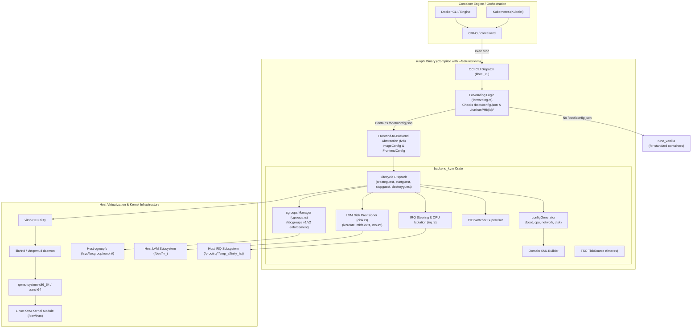
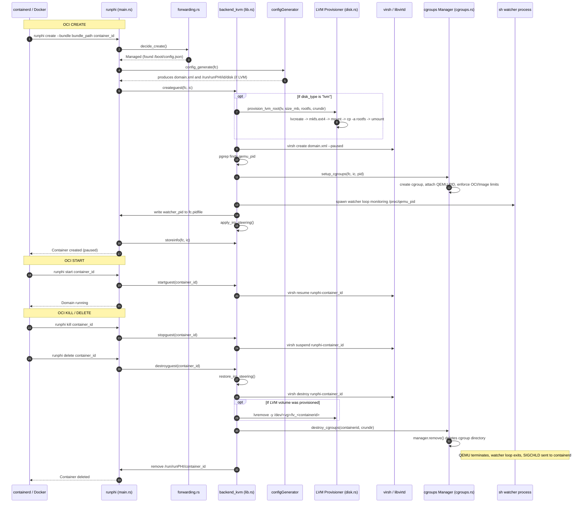

# runPHI KVM Backend — Architecture and Lifecycle

This document provides a comprehensive technical breakdown of the **KVM backend** (`backend_kvm`) in runPHI. It explains how runPHI integrates with the Linux Kernel-based Virtual Machine (KVM), Libvirt, and QEMU, details the container lifecycle state machine, explains the process supervision architecture, and describes how to set up the host environment.

---

## 1. Architectural Overview

runPHI acts as an OCI-compliant container runtime that translates standard container lifecycle operations (`create`, `start`, `kill`, `delete`, `state`) into hypervisor operations. While backends like Jailhouse target hardware partitioning and Xen targets Type-1 microkernel virtualization, **`backend_kvm`** targets standard Linux Type-2 virtualization using **KVM** and **Libvirt**.

### Layered Architecture


---

## 2. Host Prerequisites & Dependencies

To use runPHI with the KVM backend, the host system must meet the following hardware and software requirements:

### Hardware Requirements
- **CPU**: x86_64 with Intel VT-x or AMD-V support, or ARM64 (aarch64) with ARM Virtualization Extensions (EL2).
- **Virtualization Device**: `/dev/kvm` must exist and be accessible. (If absent, runPHI can run under QEMU TCG emulation, though performance will be degraded).

### Software Dependencies
Install the required tools and libraries on the host:

#### Ubuntu / Debian:
```bash
sudo apt-get update
sudo apt-get install -y \
    qemu-system-x86 \
    qemu-system-arm \
    libvirt-daemon-system \
    libvirt-clients \
    procps \
    bridge-utils \
    lvm2 \
    e2fsprogs
```

#### Arch Linux:
```bash
sudo pacman -S qemu-base libvirt procps-ng lvm2 e2fsprogs bridge-utils
```

#### RHEL / Fedora:
```bash
sudo dnf install -y qemu-kvm libvirt libvirt-client procps-ng lvm2 e2fsprogs bridge-utils
```

### Service Verification
Ensure the Libvirt daemon is enabled and running:
```bash
# For traditional monolithic libvirtd:
sudo systemctl enable --now libvirtd

# Verify virsh connectivity:
virsh uri
# Output should look like: qemu:///system
```

Verify that the current user / container daemon has access to the libvirt socket and KVM:
```bash
ls -l /dev/kvm
# crw-rw----+ 1 root kvm 10, 232 ... /dev/kvm
```

### Host LVM Storage Prerequisites

When running guests with persistent block storage using LVM (`disk_type: "lvm"` in `/boot/config.json`), runPHI provisions a dedicated host Logical Volume per container (`/dev/<vg>/lv_<containerid>`), formats it with `mkfs.ext4`, and populates it with a clone of the container rootfs.

Before runPHI can create these logical volumes, the host must have an active **Volume Group (VG)**:

1. **Default Volume Group Name**:
   By default, `backend_kvm` searches for a volume group named **`test-vg`**.

2. **Option A: Setting Up a Dedicated Disk or Partition**:
   If you have an unformatted partition or dedicated disk (e.g. `/dev/sdb` or `/dev/nvme1n1p1`):
   ```bash
   # Initialize physical volume
   sudo pvcreate /dev/sdb

   # Create the default volume group
   sudo vgcreate test-vg /dev/sdb
   ```

3. **Option B: Setting Up a Loopback-Backed Volume Group (Development / Testing)**:
   If no dedicated block device is available, create a sparse file and attach it as a loop device:
   ```bash
   # 1. Create a 10 GB backing file
   sudo truncate -s 10G /var/lib/runphi-lvm.img

   # 2. Attach backing file to the next available loop device
   sudo losetup -fP /var/lib/runphi-lvm.img

   # 3. Find the assigned loop device name (e.g. /dev/loop0)
   LOOPDEV=$(losetup -j /var/lib/runphi-lvm.img | cut -d: -f1)

   # 4. Initialize physical volume and create the volume group
   sudo pvcreate "$LOOPDEV"
   sudo vgcreate test-vg "$LOOPDEV"
   ```

4. **Custom Volume Group Override**:
   If your host uses a different volume group name (e.g. `vg_guests` or `rhel_root`):
   ```bash
   sudo mkdir -p /usr/share/runPHI
   echo "vg_guests" | sudo tee /usr/share/runPHI/kvm_lvm_vg
   ```
   `backend_kvm` reads `/usr/share/runPHI/kvm_lvm_vg` dynamically on each container creation.

5. **Verify Free Storage**:
   Verify that the volume group exists and has sufficient free space:
   ```bash
   sudo vgs
   # Output:
   # VG      #PV #LV #SN Attr   VSize   VFree
   # test-vg   1   0   0 wz--n- <10.00g <10.00g
   ```

---

## 3. Building and Installing runPHI with the KVM Backend

runPHI selects its hypervisor backend at build time through Cargo features. Exactly one backend (`jailhouse`, `xen`, or `kvm`) must be enabled.

### Native Build (x86_64)

Build directly on the host machine:

```bash
cd rust_runphi

# Build the release binary with kvm feature enabled
cargo build --release -p runphi --no-default-features --features kvm
```

The compiled binary will be located at:
`rust_runphi/target/release/runphi`

Verify the active backend:
```bash
./target/release/runphi --version
# Output: runphi 0.5.8 (backend: kvm)
```

### Cross-Compilation for ARM64 (aarch64)

Use the built-in `compile_rust.sh` script:
```bash
cd rust_runphi
./compile_rust.sh kvm
```
This builds for `--target aarch64-unknown-linux-gnu` with the `kvm` feature.

### System Installation

1. Copy the runPHI binary to the system binaries directory:
   ```bash
   sudo install -m 0755 rust_runphi/target/release/runphi /usr/local/sbin/runphi
   ```

2. Create the runPHI shared directories:
   ```bash
   sudo mkdir -p /usr/share/runPHI
   sudo mkdir -p /run/runPHI
   ```

3. Preserve vanilla runc for non-partitioned containers:
   ```bash
   # Backup original runc if replacing /usr/bin/runc, or reference /usr/local/sbin/runc_vanilla
   sudo cp -n "$(command -v runc)" /usr/local/sbin/runc_vanilla
   ```

4. Configure Docker (Optional — to use runPHI as an alternative runtime without replacing system runc):
   Add the following to `/etc/docker/daemon.json`:
   ```json
   {
     "runtimes": {
       "runphi": {
         "path": "/usr/local/sbin/runphi"
       }
     }
   }
   ```
   Then reload Docker:
   ```bash
   sudo systemctl restart docker
   ```

---

## 4. Lifecycle of a KVM-Partitioned Container

When a container engine executes an OCI command against runPHI, `runphi/src/main.rs` dispatches the call through the backend API.



### Detailed Lifecycle Operations

#### 1. `create` (`createguest`)
- **Domain Generation**: Invokes `configGenerator::config_generate` to build `/run/runPHI/<id>/domain.xml`. If `disk_type == "lvm"`, writes `/run/runPHI/<id>/disk` with the planned LV path and size.
- **LVM Storage Provisioning**: If `/run/runPHI/<id>/disk` exists, `provision_lvm_root` invokes `lvcreate` to allocate `/dev/<vg>/lv_<id>`, formats it with `mkfs.ext4`, mounts it under `/run/runPHI/<id>/mnt`, copies the entire container rootfs into the volume via `cp -a`, and unmounts it. If any command fails, `provision_lvm_root` performs best-effort cleanup (`lvremove`) and returns an error.
- **Domain Launch**: Runs `virsh create /run/runPHI/<id>/domain.xml --paused`. This provisions the QEMU process in a paused state.
- **PID Discovery**: Locates the spawned QEMU PID via `pgrep -f "qemu-system.*runphi-<id>"`.
- **cgroups Setup**: Calls `cgroups::setup_cgroups(fc, ic, pid)`. The QEMU main PID is added to the container cgroup, and resource limits (CPU quota/period, memory limit, cpuset) are applied via `libcgroups`. If cgroup setup fails, runPHI immediately calls `virsh destroy runphi-<id>` to tear down the domain before returning the error.
- **Watcher Supervision**: Spawns the supervisor watcher shell loop monitoring `/proc/<qemu_pid>` and writes its PID to `fc.pidfile`.
- **IRQ Steering**: Evaluates whether `steer_irq` is configured. If so, saves original host IRQ affinities to `saved_irq_affinities.json` and updates `/proc/irq/*/smp_affinity_list`.
- **State Storage**: Calls `storeinfo` to persist `bundle`, `pidfile`, and `OS`.

#### 2. `start` (`startguest`)
- Invokes `virsh resume runphi-<containerid>`.
- The domain transitions from paused to running.

#### 3. `kill` / `stop` (`stopguest`)
- Invokes `virsh suspend runphi-<containerid>`.
- The vCPUs are paused by the hypervisor.

#### 4. `delete` (`destroyguest` & `cleanup`)
- **IRQ Restoration**: Calls `irq::restore_irq_steering`, rolling back any modified interrupt affinities using `/run/runPHI/<id>/saved_irq_affinities.json`.
- **Domain Teardown**: Runs `virsh destroy runphi-<containerid>`. If the guest has already shut down cleanly (e.g. from an internal `poweroff`), errors like `"domain is not running"` are logged and ignored.
- **LVM Teardown**: If `/run/runPHI/<id>/disk` exists, reads the allocated LV path and executes `lvremove -y <lv>`, ensuring no orphaned block devices remain on the host.
- **cgroups Teardown**: Calls `cgroups::destroy_cgroups(containerid, crundir)` to delete the host cgroup directory via `libcgroups`.
- **State Deletion**: Removes `/run/runPHI/<id>/`.

---

## 5. The Watcher Process Mechanism

### The Problem
In standard container runtimes, the OCI runtime (`runc`) creates the container process directly as its own child. The runtime writes the PID of this child into the OCI `--pid-file`. When the child terminates, the container manager (containerd or dockerd) receives a `SIGCHLD` signal and transitions the container state to `Stopped`.

In the KVM backend, **the QEMU process is a child of `libvirtd`**, not runPHI or containerd:
```
systemd
 ├── containerd
 └── libvirtd
      └── qemu-system-x86_64 (Domain runphi-<id>)
```
If runPHI wrote the raw QEMU PID into `--pid-file`, containerd would fail to track its lifecycle because containerd is not the parent of QEMU. containerd would never receive `SIGCHLD` when QEMU exits, leaving the container permanently stuck in status `"Up"`. Furthermore, standard termination signals sent to `--pid-file` would not integrate cleanly with Libvirt's management.

### The Solution: The Supervisor Watcher
During `createguest`, runPHI spawns a minimal watcher process:

```rust
let watcher = Command::new("sh")
    .arg("-c")
    .arg(format!(
        "while [ -d /proc/{} ]; do sleep 0.2; done",
        qemu_pid
    ))
    .stdin(Stdio::null())
    .stdout(Stdio::null())
    .stderr(Stdio::null())
    .spawn()?;

let watcher_pid = watcher.id().to_string();
fs::write(&fc.pidfile, watcher_pid)?;
```

1. runPHI finds the QEMU PID via `pgrep -f "qemu-system.*runphi-<containerid>"`.
2. It launches an independent shell loop monitoring `/proc/<qemu_pid>`.
3. It records the **watcher's PID** in the container's OCI `pidfile`.
4. containerd supervises this watcher process as the container's primary process.
5. When `virsh destroy` terminates QEMU (or the guest powers off), `/proc/<qemu_pid>` disappears.
6. The watcher loop breaks and the watcher terminates.
7. containerd receives `SIGCHLD` immediately and updates the container's status to stopped.

---

## 6. Resource Partitioning & Sandboxing with cgroups (`cgroups.rs`)

While Libvirt pins guest virtual CPUs to specific physical host cores using `<cputune>`, QEMU itself runs as a standard host user process. Confining this hypervisor process under host control groups (**cgroups**) is crucial for production multi-tenant and real-time environments.

The `backend_kvm` crate implements dedicated cgroups management in `crates/backend_kvm/src/cgroups.rs` using the [`libcgroups`](https://crates.io/crates/libcgroups) (v0.7.0) library.

### Why cgroups Are Essential for KVM Containers

1. **Auxiliary Thread Confinement**: A running QEMU domain contains multiple threads beyond vCPU workers: the main emulator event loop, memory management threads, and asynchronous block/network I/O workers. Without host cgroups, these non-vCPU threads roam across all host cores (including real-time cores isolated for other workloads), causing severe latency spikes (jitter).
2. **Host Memory Sandboxing**: Libvirt does not restrict the host memory consumed by QEMU's internal allocations, page tables, and DMA buffers. Enforcing host memory cgroups prevents a guest from exhausting host RAM.
3. **OCI Parity**: Passing resource flags like `--cpuset-cpus`, `--memory`, or `--cpu-quota` to `docker run` ensures that the QEMU process obeys the exact same resource constraints as standard Linux containers (`runc`).

### How `cgroups.rs` Works

```mermaid
flowchart TD
    subgraph create["createguest Pipeline"]
        pgrep["pgrep finds QEMU PID"] --> resolve["resolve_cgroup_path()<br/>(OCI cgroupsPath or runphi/{id})"]
        resolve --> save_state["Save cgroup_path & systemd_cgroup<br/>in /run/runPHI/{id}/"]
        save_state --> init_mgr["create_cgroup_manager()<br/>(cgroups v1/v2, cgroupfs/systemd)"]
        init_mgr --> attach["manager.add_task(qemu_pid)<br/>(Attaches main PID; child threads inherit)"]
        attach --> res["build_linux_resources()<br/>(OCI resources + ic.memory fallback)"]
        res --> apply["manager.apply(&controller_opt)<br/>(Applies memory, cpuset, cpu quota, OOM score)"]
        apply -->|Success| proceed["Proceed with Watcher & IRQ Steering"]
        apply -->|Failure| abort["virsh destroy & abort create"]
    end

    subgraph destroy["destroyguest Pipeline"]
        read_state["Read /run/runPHI/{id}/cgroup_path"] --> del_mgr["create_cgroup_manager()"]
        del_mgr --> remove["manager.remove()<br/>(Deletes /sys/fs/cgroup/runphi/{id})"]
    end
```



### Key Implementation Mechanisms

#### 1. Path Resolution (`resolve_cgroup_path`)
The cgroup destination path is resolved from the OCI configuration:
- If `fc.jsonconfig["linux"]["cgroupsPath"]` is specified, runPHI strips leading slashes (e.g. `/system.slice/runphi-cont.scope` becomes `system.slice/runphi-cont.scope`) and uses it.
- If omitted or empty, runPHI defaults to `runphi/<container_id>`, creating `/sys/fs/cgroup/runphi/<container_id>` under cgroups v2.

#### 2. Driver and Hierarchy Abstraction
Using `libcgroups`, `cgroups.rs` automatically detects the host hierarchy:
- **cgroups v2 (Unified Hierarchy)**: Standard on modern distributions (Arch Linux, Fedora, Ubuntu 22.04+).
- **cgroups v1 (Legacy Hierarchies)**: Supported on older systems or kernels booted with `systemd.unified_cgroup_hierarchy=0`.
- **Driver**: Inspects `fc.jsonconfig["systemd_cgroup"]` to use either the systemd D-Bus interface or direct cgroupfs manipulation.

The resolved path and driver flag are saved to `/run/runPHI/<id>/cgroup_path` and `/run/runPHI/<id>/systemd_cgroup`.

#### 3. Task Attachment
```rust
let nix_pid = Pid::from_raw(pid as i32);
manager.add_task(nix_pid)?;
```
Adding the QEMU main PID moves the entire process into the cgroup. Under the Linux kernel task hierarchy, all existing worker threads and any subsequently spawned threads (such as vCPU threads and I/O event loops) automatically inherit this cgroup confinement.

#### 4. Resource Formulation & Fallbacks (`build_linux_resources`)
`build_linux_resources` parses OCI resource constraints from `fc.jsonconfig["linux"]["resources"]`:
- **CPU Quota and Period**: Configured via Docker `--cpu-quota` and `--cpu-period`.
- **CPU Set (`cpuset.cpus`)**: Configured via Docker `--cpuset-cpus` (e.g. `--cpuset-cpus=2,3`).
- **Memory Limit**: Deserialized from `resources.memory.limit`.
- **Fallback Memory Limit**: If `resources.memory` is unset in the OCI spec, but `/boot/config.json` specifies `ic.memory > 0`, runPHI builds a `LinuxMemoryBuilder` limit and applies it to the cgroup:
  ```rust
  if ic.memory > 0 && resources.memory().is_none() {
      let mem = LinuxMemoryBuilder::default()
          .limit((ic.memory * 1024 * 1024) as i64)
          .build()?;
      resources.set_memory(Some(mem));
  }
  ```
- **OOM Score Adjustment**: `fc.jsonconfig["process"]["oomScoreAdj"]` is applied to `ControllerOpt` to configure kernel out-of-memory killing priority.

#### 5. Failure Handling
If `manager.apply()` fails during `setup_cgroups`, runPHI immediately invokes `virsh destroy runphi-<id>` to eliminate the unconfined virtual machine before propagating the error back to the container engine.

#### 6. Freezing, Telemetry, and Teardown
- **Freeze / Resume**: `freeze_cgroups(containerid, crundir, freeze)` toggles `FreezerState::Frozen` / `FreezerState::Thawed`, enabling OCI `pause`/`resume` semantics for KVM guests.
- **Resource Telemetry**: `get_cgroup_stats(containerid, crundir)` queries `manager.stats()` to extract CPU, memory, and blkio accounting statistics for monitoring tools.
- **Teardown**: During `destroyguest`, `destroy_cgroups` loads the saved state files and invokes `manager.remove()`, unlinking the cgroup directory.

---

## 7. Real-Time Isolation & Interrupt Steering (`irq.rs`)

When running real-time or safety-critical tasks in a partitioned container, non-real-time host interrupts (such as network cards, disk controllers, and USB devices) can interrupt the isolated CPU cores and introduce latency spikes (jitter).

The `backend_kvm` crate includes an automated **IRQ steering** subsystem in `crates/backend_kvm/src/irq.rs`.

### How It Works

1. **Host Isolation Discovery**:
   The module inspects the host kernel's isolated core lists:
   - `/sys/devices/system/cpu/isolated` (Linux `isolcpus` boot parameter)
   - `/sys/devices/system/cpu/nohz_full` (Full tickless real-time cores)
   - Merges these with any container-specific `isolcpu` and `nohz_full` definitions in `/boot/config.json`.

2. **Steering Target Validation**:
   When `steer_irq` (or `irq_steering`) is defined in `/boot/config.json`:
   ```json
   {
     "steer_irq": [0, 1]
   }
   ```
   The module verifies that none of the target CPUs (`[0, 1]`) are in the isolated core list. If an isolated core is specified as a target, runPHI logs a warning to prevent accidental latency degradation.

3. **Dynamic Affinity Reconfiguration**:
   For every hardware interrupt exposed under `/proc/irq/<num>/smp_affinity_list`:
   - It reads the current affinity and saves it in `/run/runPHI/<id>/saved_irq_affinities.json`.
   - It writes the target CPU list (e.g. `"0,1"`) to `/proc/irq/<num>/smp_affinity_list`.
   - Architecture-fixed interrupts (such as timer IRQ 0) that cannot be redirected are skipped gracefully.

4. **Rollback on Teardown**:
   When `destroyguest` is invoked, `irq::restore_irq_steering` reads `saved_irq_affinities.json` and restores all original CPU affinities across the host, ensuring no permanent host contamination.

---

## 8. Performance Instrumentation & Timer (`timer.rs`)

runPHI features a zero-overhead monotonic timer used for measuring runtime execution phases and boot timing.

Under `backend_kvm`, `src/timer.rs` implements the `TickSource` trait using the x86 Time Stamp Counter (TSC):

```rust
#[inline(always)]
fn read_ticks(&self) -> u64 {
    #[cfg(target_arch = "x86_64")]
    {
        let low: u32;
        let high: u32;
        unsafe {
            std::arch::asm!(
                "lfence",
                "rdtsc",
                out("eax") low,
                out("edx") high,
                options(nomem, nostack, preserves_flags)
            );
        }
        ((high as u64) << 32) | (low as u64)
    }
    #[cfg(not(target_arch = "x86_64"))]
    {
        0
    }
}
```

- **Serializing Instruction (`lfence`)**: Prevents out-of-order execution from reading the counter prematurely.
- **Graceful Fallback**: On non-x86 architectures or systems where TSC access is restricted, `install()` logs a warning and returns `0` without blocking container execution.

---

## 9. On-Disk State Reference

During container execution, `backend_kvm` maintains state files under `/run/runPHI/<containerid>/`:

| File Path | Description |
|---|---|
| `/run/runPHI/<id>/domain.xml` | Generated Libvirt Domain XML definition. |
| `/run/runPHI/<id>/bundle` | Absolute path to the container OCI bundle directory. |
| `/run/runPHI/<id>/pidfile` | Path to the OCI pidfile containing the watcher PID. |
| `/run/runPHI/<id>/OS` | Stores the guest OS classification (e.g. `linux`, `zephyr`). |
| `/run/runPHI/<id>/cgroup_path` | Stored relative path to the container's cgroup directory. |
| `/run/runPHI/<id>/systemd_cgroup` | Flag indicating whether the systemd cgroup driver is active (`1` or `0`). |
| `/run/runPHI/<id>/disk` | State file containing the planned LVM volume path and size (e.g. `/dev/test-vg/lv_<id> 2048`). |
| `/run/runPHI/<id>/mnt/` | Temporary mount point directory used during rootfs cloning to LVM. |
| `/run/runPHI/<id>/saved_irq_affinities.json` | JSON mapping of original host IRQ affinities before steering was applied. |
| `/usr/share/runPHI/kvm_lvm_vg` | Optional host-wide configuration file overriding the default LVM volume group name (`test-vg`). |
| `/usr/share/runPHI/log.txt` | Global runPHI execution log. |

---

Proceed to **[Config Generator Modules Deep Dive](config_generator.md)** to examine how the Domain XML is generated in detail.
