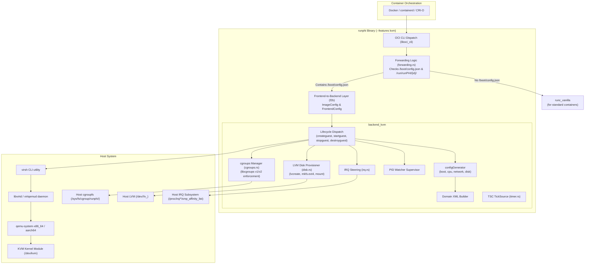
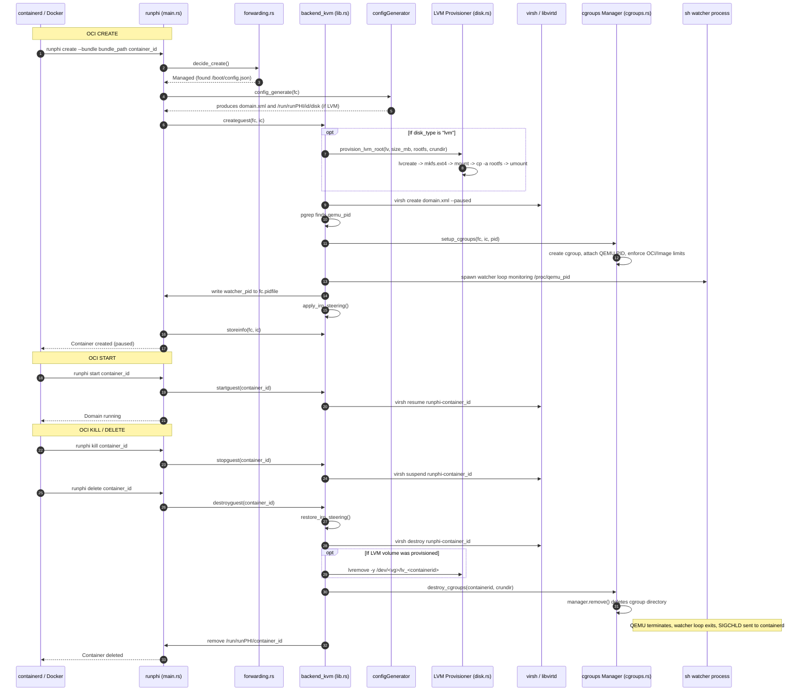

# runPHI KVM Backend — Architecture and Lifecycle

`backend_kvm` enables runPHI to map standard OCI container lifecycle operations (`create`, `start`, `kill`, `delete`, `state`) to virtual machines backed by Linux KVM, Libvirt, and QEMU. This document describes the backend architecture, process management, resource controls (cgroups and IRQ steering), host requirements, and runtime lifecycle.

---

## Architecture



### Libvirt Integration

runPHI drives Libvirt via `virsh` rather than spawning raw QEMU processes directly:
- **Declarative specification**: Libvirt Domain XML separates VM definition from hypervisor CLI flags across `x86_64` and `aarch64`.
- **Resource resolution**: Libvirt manages bus topologies, PCI bridges, virtio device addresses, and PTY allocations for serial consoles.
- **TCG fallback**: If hardware virtualization (`/dev/kvm`) is absent, Libvirt transparently falls back to QEMU TCG software emulation without altering the runtime interface.
- **Lifecycle containment**: Standard domain policies (`on_poweroff=destroy`, `on_reboot=destroy`, `on_crash=destroy`) ensure instances terminate cleanly on guest halt.

---

## Host Prerequisites and Setup

### Hardware Requirements
- **CPU**: x86_64 with Intel VT-x or AMD-V, or ARM64 (aarch64) with ARM Virtualization Extensions (EL2).
- **Virtualization Device**: `/dev/kvm` must exist and be accessible.

### Software Dependencies
Install the required virtualization and storage utilities:

#### Ubuntu / Debian:
```bash
sudo apt-get update
sudo apt-get install -y \
    qemu-system-x86 \
    qemu-system-arm \
    libvirt-daemon-system \
    libvirt-clients \
    procps \
    bridge-utils \
    lvm2 \
    e2fsprogs
```

#### Arch Linux:
```bash
sudo pacman -S qemu-base libvirt procps-ng lvm2 e2fsprogs bridge-utils
```

#### RHEL / Fedora:
```bash
sudo dnf install -y qemu-kvm libvirt libvirt-client procps-ng lvm2 e2fsprogs bridge-utils
```

### Service Verification
Enable and start the Libvirt daemon:
```bash
sudo systemctl enable --now libvirtd

# Verify virsh connectivity:
virsh uri
# Output should return: qemu:///system
```

Verify KVM permissions:
```bash
ls -l /dev/kvm
# crw-rw----+ 1 root kvm 10, 232 ... /dev/kvm
```

### LVM Storage Setup

When running guests with persistent block storage using LVM (`disk_type: "lvm"` in `/boot/config.json`), runPHI provisions a dedicated host Logical Volume per container (`/dev/<vg>/lv_<containerid>`), formats it with `mkfs.ext4`, and copies the container rootfs into it.

The host must have an active Volume Group before launching LVM containers.

By default, runPHI looks for a Volume Group named `test-vg`. To use a different name, configure the override file:
```bash
sudo mkdir -p /usr/share/runPHI
echo "my_vg" | sudo tee /usr/share/runPHI/kvm_lvm_vg
```

#### Option A: Using a Dedicated Disk or Partition
```bash
# Initialize the physical volume
sudo pvcreate /dev/sdb

# Create the volume group
sudo vgcreate test-vg /dev/sdb
```

#### Option B: Using a Loopback File (Testing / Development)
```bash
# Create a 10 GB backing file
sudo truncate -s 10G /var/lib/runphi-lvm.img

# Attach to an available loop device
sudo losetup -fP /var/lib/runphi-lvm.img
LOOPDEV=$(losetup -j /var/lib/runphi-lvm.img | cut -d: -f1)

# Initialize PV and create the VG
sudo pvcreate "$LOOPDEV"
sudo vgcreate test-vg "$LOOPDEV"
```

Verify available capacity:
```bash
sudo vgs
```

---

## Building and Installation

### Native Build (x86_64)

```bash
cd rust_runphi
cargo build --release -p runphi --no-default-features --features kvm
```

The compiled binary will be placed at `rust_runphi/target/release/runphi`.

Check the compiled backend:
```bash
./target/release/runphi --version
# Output: runphi 0.5.8 (backend: kvm)
```

### Cross-Compilation for ARM64 (aarch64)

```bash
cd rust_runphi
./compile_rust.sh kvm
```

### System Installation

```bash
# Copy binary
sudo install -m 0755 rust_runphi/target/release/runphi /usr/local/sbin/runphi

# Create shared state directories
sudo mkdir -p /usr/share/runPHI /run/runPHI

# Preserve original runc for non-partitioned containers
sudo cp -n "$(command -v runc)" /usr/local/sbin/runc_vanilla
```

#### Docker Configuration (Optional)
To register runPHI as a Docker runtime without replacing system runc, add this to `/etc/docker/daemon.json`:
```json
{
  "runtimes": {
    "runphi": {
      "path": "/usr/local/sbin/runphi"
    }
  }
}
```
Then restart Docker:
```bash
sudo systemctl restart docker
```

---

## Container Lifecycle

When a container engine invokes runPHI, `runphi/src/main.rs` dispatches the command through the backend interface:



### Lifecycle Operations

#### 1. `create` (`createguest`)
- **Domain generation**: Calls `configGenerator::config_generate` to write `/run/runPHI/<id>/domain.xml`. If `disk_type == "lvm"`, writes `/run/runPHI/<id>/disk` with the target LV path and size.
- **LVM provisioning**: If `/run/runPHI/<id>/disk` exists, `provision_lvm_root` allocates `/dev/<vg>/lv_<id>` via `lvcreate`, formats it with `mkfs.ext4`, mounts it at `/run/runPHI/<id>/mnt`, copies the rootfs via `cp -a`, and unmounts. If any step fails, rollback unmounts and removes the LV.
- **Domain spawn**: Runs `virsh create /run/runPHI/<id>/domain.xml --paused`, provisioning QEMU in a paused state.
- **PID discovery**: Finds the QEMU PID via `pgrep -f "qemu-system.*runphi-<id>"`.
- **cgroups setup**: Calls `cgroups::setup_cgroups(fc, ic, pid)`. Attaches the QEMU PID and applies OCI CPU/memory limits. If setup fails, runPHI immediately runs `virsh destroy` to prevent unconfined VM execution.
- **Watcher supervision**: Starts the supervisor watcher monitoring `/proc/<qemu_pid>` and writes its PID to `fc.pidfile`.
- **IRQ steering**: If `steer_irq` is configured, backs up host affinities and updates `/proc/irq/*/smp_affinity_list`.
- **State recording**: Writes `bundle`, `pidfile`, and `OS` to `/run/runPHI/<id>/`.

#### 2. `start` (`startguest`)
- Runs `virsh resume runphi-<containerid>`. The domain transitions from paused to running.

#### 3. `kill` / `stop` (`stopguest`)
- Runs `virsh suspend runphi-<containerid>`. Hypervisor pauses all vCPUs.

#### 4. `delete` (`destroyguest` & `cleanup`)
- **IRQ restoration**: Restores saved host interrupt affinities from `saved_irq_affinities.json`.
- **Domain teardown**: Runs `virsh destroy runphi-<containerid>`. If the domain already powered off internally, the error is logged and ignored.
- **LVM removal**: If `/run/runPHI/<id>/disk` exists, runs `lvremove -y <lv>`.
- **cgroups cleanup**: Calls `cgroups::destroy_cgroups` to remove the cgroup directory.
- **State cleanup**: Removes `/run/runPHI/<id>/`.

---

## Process Supervision (The Watcher)

In standard OCI runtimes (`runc`), the runtime creates the container process directly as a child and writes its PID into `--pid-file`. containerd monitors that PID for exit (`SIGCHLD`).

In `backend_kvm`, **QEMU is spawned by `libvirtd`**, not runPHI:
```
systemd
 ├── containerd
 └── libvirtd
      └── qemu-system-x86_64 (Domain runphi-<id>)
```

If runPHI wrote QEMU's PID into `--pid-file`, containerd could not supervise it because containerd is not its parent. containerd would never receive `SIGCHLD` upon QEMU exit, leaving the container stuck in status `Up`.

To fix this, `createguest` spawns a minimal supervisor watcher shell process:

```rust
let watcher = Command::new("sh")
    .arg("-c")
    .arg(format!("while [ -d /proc/{} ]; do sleep 0.2; done", qemu_pid))
    .stdin(Stdio::null())
    .stdout(Stdio::null())
    .stderr(Stdio::null())
    .spawn()?;

let watcher_pid = watcher.id().to_string();
fs::write(&fc.pidfile, watcher_pid)?;
```

1. runPHI discovers the QEMU PID via `pgrep`.
2. It spawns the watcher loop tracking `/proc/<qemu_pid>`.
3. It writes the **watcher's PID** to the container's OCI `pidfile`.
4. containerd supervises the watcher.
5. When QEMU exits (via internal poweroff or `virsh destroy`), `/proc/<qemu_pid>` disappears.
6. The watcher loop terminates, sending `SIGCHLD` to containerd, which marks the container as stopped.

---

## cgroups and Resource Sandboxing (`cgroups.rs`)

Libvirt's `<cputune>` pins vCPU threads to physical CPUs, but QEMU itself is a standard host user process with auxiliary threads: the main emulator event loop, memory allocators, and asynchronous I/O workers. Without host cgroups, these non-vCPU threads roam across all host cores—including real-time cores isolated for other workloads. Furthermore, QEMU host memory consumption is unbounded without cgroups.

`backend_kvm` manages cgroups via `crates/backend_kvm/src/cgroups.rs` using the [`libcgroups`](https://crates.io/crates/libcgroups) crate.

### Implementation Details

#### 1. Path Resolution (`resolve_cgroup_path`)
- Inspects `fc.jsonconfig["linux"]["cgroupsPath"]`. If specified, strips leading slashes (e.g. `/system.slice/runphi-cont.scope` becomes `system.slice/runphi-cont.scope`).
- If omitted or empty, defaults to `runphi/<container_id>` (resolved under `/sys/fs/cgroup/runphi/<container_id>` on cgroups v2).

#### 2. Hierarchy and Driver Support
`libcgroups` auto-detects the host setup:
- **cgroups v2 (Unified Hierarchy)**: Standard on modern distributions.
- **cgroups v1 (Legacy Hierarchies)**: Supported on older kernels or when booted with `systemd.unified_cgroup_hierarchy=0`.
- **Driver**: Inspects `fc.jsonconfig["systemd_cgroup"]` to toggle between systemd D-Bus management and direct cgroupfs manipulation.

The path and driver preference are saved in `/run/runPHI/<id>/cgroup_path` and `/run/runPHI/<id>/systemd_cgroup`.

#### 3. Task Attachment
```rust
let nix_pid = Pid::from_raw(pid as i32);
manager.add_task(nix_pid)?;
```
Adding the QEMU main PID automatically confines all current and subsequently spawned child threads (vCPUs, I/O dispatchers) to the same cgroup.

#### 4. Resource Constraints & Fallback (`build_linux_resources`)
`build_linux_resources` extracts OCI resource limits from `fc.jsonconfig["linux"]["resources"]`:
- **CPU Quota and Period**: Configured via Docker `--cpu-quota` and `--cpu-period`.
- **CPU Affinity (`cpuset.cpus`)**: Configured via Docker `--cpuset-cpus` (e.g. `--cpuset-cpus=2,3`).
- **Memory Limit**: Deserialized from `resources.memory.limit`.
- **Memory Fallback**: If `resources.memory` is unset in the OCI spec, but `/boot/config.json` sets `ic.memory > 0`, runPHI builds a `LinuxMemoryBuilder` limit for `ic.memory * 1024 * 1024` bytes and applies it to the cgroup.
- **OOM Score**: Applies `fc.jsonconfig["process"]["oomScoreAdj"]`.

#### 5. Failure Policy
If `manager.apply()` fails during `setup_cgroups`, runPHI immediately invokes `virsh destroy runphi-<id>` to terminate the unconfined VM before returning an error to the container engine.

#### 6. Teardown
During `destroyguest`, `destroy_cgroups` re-reads the stored cgroup path and driver, calling `manager.remove()` to unlink the cgroup directory.

---

## Real-Time Isolation & Interrupt Steering (`irq.rs`)

Host hardware interrupts (network adapters, NVMe controllers, USB) targeting real-time cores introduce unpredictable scheduling jitter. `crates/backend_kvm/src/irq.rs` dynamically redirects host interrupts away from real-time cores during container execution.

### Mechanism

1. **Host Isolation Discovery**:
   Reads `/sys/devices/system/cpu/isolated` (`isolcpus`) and `/sys/devices/system/cpu/nohz_full`, merging them with `isolcpu` and `nohz_full` from `/boot/config.json`.

2. **Target Validation**:
   When `steer_irq` is configured:
   ```json
   {
     "steer_irq": [0, 1]
   }
   ```
   runPHI verifies that none of the target CPUs (`[0, 1]`) are in the isolated core list. If an isolated core is specified as a target, runPHI logs a warning.

3. **Dynamic Reconfiguration**:
   For every entry under `/proc/irq/<num>/smp_affinity_list`:
   - Saves the current affinity to `/run/runPHI/<id>/saved_irq_affinities.json`.
   - Writes the target CPU list (e.g. `"0,1"`) to `/proc/irq/<num>/smp_affinity_list`.
   - Architecture-fixed interrupts (e.g. timer IRQ 0) are skipped gracefully.

4. **Rollback on Teardown**:
   When `destroyguest` runs, `irq::restore_irq_steering` restores all original affinities from `saved_irq_affinities.json`.

---

## Monotonic Timer (`timer.rs`)

`src/timer.rs` implements runPHI's `TickSource` trait using the x86 Time Stamp Counter (TSC):

```rust
#[inline(always)]
fn read_ticks(&self) -> u64 {
    #[cfg(target_arch = "x86_64")]
    {
        let low: u32;
        let high: u32;
        unsafe {
            std::arch::asm!(
                "lfence",
                "rdtsc",
                out("eax") low,
                out("edx") high,
                options(nomem, nostack, preserves_flags)
            );
        }
        ((high as u64) << 32) | (low as u64)
    }
    #[cfg(not(target_arch = "x86_64"))]
    {
        0
    }
}
```

The `lfence` instruction serializes execution to prevent out-of-order counter reads. On non-x86 targets, `install()` logs a warning and returns `0`.

---

## On-Disk State

State files created under `/run/runPHI/<containerid>/` during container runtime:

| File Path | Description |
|---|---|
| `/run/runPHI/<id>/domain.xml` | Generated Libvirt Domain XML definition. |
| `/run/runPHI/<id>/bundle` | Path to the container OCI bundle directory. |
| `/run/runPHI/<id>/pidfile` | Path to the OCI pidfile containing the watcher PID. |
| `/run/runPHI/<id>/OS` | Guest OS classification (`linux`, `zephyr`). |
| `/run/runPHI/<id>/cgroup_path` | Saved relative path to the container's cgroup directory. |
| `/run/runPHI/<id>/systemd_cgroup` | Driver flag (`1` for systemd, `0` for cgroupfs). |
| `/run/runPHI/<id>/disk` | State file containing the planned LVM volume path and size (`<lv_path> <size_mb>`). |
| `/run/runPHI/<id>/mnt/` | Temporary mount point used while copying the rootfs to the LVM volume. |
| `/run/runPHI/<id>/saved_irq_affinities.json` | Host IRQ affinities before steering was applied. |
| `/usr/share/runPHI/kvm_lvm_vg` | Host configuration file overriding the default LVM volume group name (`test-vg`). |
| `/usr/share/runPHI/log.txt` | Global runPHI execution log. |
