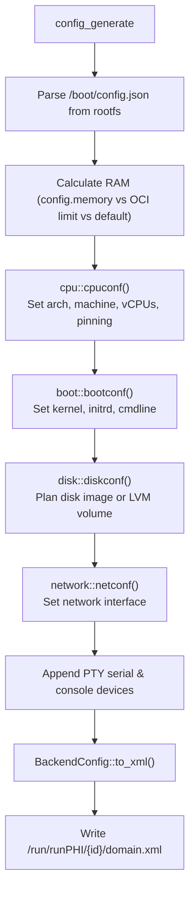

# runPHI KVM Backend — Config Generator

`configGenerator` translates `/boot/config.json` and the container's OCI runtime specification into a Libvirt Domain XML document written to `/run/runPHI/<containerid>/domain.xml`.

---

## Module Layout

```
crates/backend_kvm/src/
├── configGenerator.rs       # Top-level orchestration & Domain XML assembly
├── configGenerator/
│   ├── boot.rs              # Kernel, initramfs, DTB, and cmdline arguments
│   ├── cpu.rs               # Architecture, machine type, vCPUs, pinning, and KVM/TCG mode
│   ├── disk.rs              # Block device configuration & host LVM provisioning
│   └── network.rs           # Virtual NIC definitions (SLIRP, Bridge, Libvirt network)
├── cgroups.rs               # Host cgroup isolation & resource limits (libcgroups)
├── irq.rs                   # Host CPU isolation detection and IRQ affinity steering
└── timer.rs                 # x86 TSC monotonic timer
```

### The `BackendConfig` Struct

`configGenerator.rs` collects domain parameters into `BackendConfig`:

```rust
#[derive(Debug, Default)]
pub struct BackendConfig {
    pub domain_type: String,      // "kvm" (hardware-accelerated) or "qemu" (TCG software emulation)
    pub name: String,             // Domain name ("runphi-<containerid>")
    pub memory_kib: u64,          // Total RAM in KiB
    pub vcpus: u32,               // Number of vCPUs allocated
    pub cputune_xml: String,      // <cputune> block with <vcpupin> elements
    pub cpu_xml: String,          // <cpu mode='...'> block
    pub os_arch: String,          // "x86_64" or "aarch64"
    pub os_machine: String,       // Machine model ("q35" for x86, "virt" for ARM)
    pub os_boot_xml: String,      // Boot elements: <kernel>, <initrd>, <cmdline>, <dtb>
    pub features_xml: String,     // Features: <acpi/>, <apic/>, <gic/>
    pub devices_xml: Vec<String>, // Attached devices: disks, interfaces, serial, console
    pub xml_file: PathBuf,        // Output path (/run/runPHI/<id>/domain.xml)
}
```

### Configuration Generation Pipeline

The entry point is `configGenerator::config_generate(fc: &f2b::FrontendConfig)`:



1. **Parse boot config**: Reads `/boot/config.json` from the container's root filesystem (`fc.mountpoint`). All relative paths are resolved against this rootfs.
2. **Compute RAM**:
   - Uses `config.memory` (in MB) if set.
   - Falls back to the OCI limit: `fc.jsonconfig["linux"]["resources"]["memory"]["limit"]` (converted from bytes to MB).
   - If both are unset, defaults to **1024 MB** for Linux and **32 MB** for bare-metal inmates.
   - Multiplies by 1024 to pass KiB to Libvirt.
3. **Dispatch submodules**: Invokes `cpu::cpuconf`, `boot::bootconf`, `disk::diskconf`, and `network::netconf`.
4. **Append console devices**:
   - PTY Serial device: `<serial type='pty'><target type='isa-serial' port='0'/></serial>`
   - Primary Console: `<console type='pty'><target type='serial' port='0'/></console>`
5. **Serialize to XML**: Calls `BackendConfig::to_xml()` and writes the resulting XML to disk.

---

## Submodule Reference

### CPU and Machine Configuration (`cpu.rs`)

Configures machine architecture, hypervisor mode, vCPU count, and CPU affinities.

#### Architecture and Hypervisor Detection

| Parameter | `x86_64` | `aarch64` |
|---|---|---|
| Machine model (`os_machine`) | `q35` | `virt` |
| Hardware features (`features_xml`) | `<acpi/>`<br/>`<apic/>` | `<gic version='3'/>` |
| With `/dev/kvm` available | `domain_type = "kvm"`<br/>`<cpu mode='host-passthrough' check='none'/>` | `domain_type = "kvm"`<br/>`<cpu mode='host-passthrough' check='none'/>` |
| Without `/dev/kvm` (Fallback) | `domain_type = "qemu"`<br/>`<cpu mode='custom'><model>qemu64</model></cpu>` | `domain_type = "qemu"`<br/>`<cpu mode='custom'><model>max</model></cpu>` |

#### vCPU Sizing Hierarchy

`cpuconf` derives allocated vCPUs through this priority order:

1. **Explicit `vcpus`**: Value from `/boot/config.json`.
2. **vCPU Pinning Length**: If `vcpus` is unset, uses `vcpu_pinning.len()`.
3. **OCI cgroups Quota**: If neither is set, checks `fc.jsonconfig["linux"]["resources"]["cpu"]["quota"]` and `period`. If both are positive:
   $$\text{oci\_cpus} = \left\lceil \frac{\text{quota}}{\text{period}} \right\rceil$$
4. **Default**: Falls back to `1` vCPU.

If `vcpus` in `/boot/config.json` exceeds the OCI cgroup quota, runPHI logs a warning:
`runPHI is allocating X vCPUs, but the container has a limit of Y CPUs (quota: Z)`

#### vCPU Pinning (`<cputune>`) vs. Process cgroups (`cpuset.cpus`)

- **Libvirt `<cputune>`**: When `vcpu_pinning` is defined in `/boot/config.json`, Libvirt pins each vCPU thread to a specific host CPU core:
  ```xml
  <cputune>
    <vcpupin vcpu='0' cpuset='2'/>
    <vcpupin vcpu='1' cpuset='3'/>
  </cputune>
  ```
- **Host cgroups (`cgroups.rs`)**: When the user passes `--cpuset-cpus=2,3` to Docker, `cgroups.rs` writes `2,3` into `/sys/fs/cgroup/runphi/<id>/cpuset.cpus`. This confines **the entire QEMU process** (including the main emulator thread and I/O worker threads) to those cores, preventing unpinned helper threads from interfering with other host workloads.

---

### Boot and Kernel Configuration (`boot.rs`)

Configures direct kernel boot parameters based on the guest operating system:

#### Linux Guests (`os_var: "linux"`)
- `<kernel>`: Path to the kernel binary (`inmate`, e.g. `/boot/Image`).
- `<initrd>`: Path to the initial ramdisk (`ramdisk`, e.g. `/boot/rootfs.cpio.gz`).
- `<dtb>`: Path to an ARM Device Tree Blob (optional, `dtb`).
- `<cmdline>`: Kernel boot arguments:
  - With block disk (`disk_type` is `"file"` or `"lvm"`): `console=ttyS0,115200 root=/dev/vda rw`
  - With initramfs: `console=ttyS0,115200`

#### Bare-Metal and Unikernels (`os_var != "linux"`)
For non-Linux payloads (e.g. Zephyr RTOS or ELF binaries):
- Generates only the `<kernel>` element pointing to the executable (`inmate`).
- Omits `<initrd>`, `<cmdline>`, and `<dtb>`.

---

### Network Configuration (`network.rs`)

Configures guest network interfaces via virtio-net.

#### Evaluation
`is_net_enabled` disables networking if `net` is set to `""`, `"no"`, `"none"`, `"false"`, `"off"`, `"disabled"`, or `"0"`. Any other value enables networking.

#### Modes

| Configuration (`"net"`) | Output Libvirt XML | Description |
|---|---|---|
| `"user"` or `"slirp"` | `<interface type='user'><model type='virtio'/></interface>` | QEMU User-mode (SLIRP) NAT. Isolated, requires no host bridge or root privileges. |
| `"bridge:<name>"` | `<interface type='bridge'><source bridge='<name>'/><model type='virtio'/></interface>` | Attaches guest virtio-net directly to the specified host bridge. |
| `"bridge"` | `<interface type='bridge'><source bridge='...'/><model type='virtio'/></interface>` | Uses `"netconf"` if provided; otherwise detects available bridges (`virbr0`, `docker0`, `xenbr0`, `br0`). |
| `"network:<name>"` | `<interface type='network'><source network='<name>'/><model type='virtio'/></interface>` | Attaches to a managed Libvirt virtual network (e.g. `default`). |
| Host Bridge Name (e.g. `"docker0"`) | `<interface type='bridge'><source bridge='docker0'/><model type='virtio'/></interface>` | If `/sys/class/net/<name>` exists, attaches directly to that bridge. |
| Default (`"yes"` or `"true"`) | Auto-detection | Checks for `virtnetworkd-sock` (uses network `default`), then checks for host bridges, falling back to SLIRP. |

---

### Storage and Disk Management (`disk.rs`)

Supports three root filesystem strategies configured via `disk_type` in `/boot/config.json`:

| Strategy | `disk_type` | Libvirt XML | Description |
|---|---|---|---|
| **RAM Root** | `""` (default) | None | Guest boots using an initramfs (`ramdisk`) in memory; no block device attached. |
| **File-Backed** | `"file"` | `<disk type='file' device='disk'>` | Attaches a raw ext4 image (`disk_image`) located inside the container rootfs. |
| **Host LVM** | `"lvm"` | `<disk type='block' device='disk'>` | Provisions a dedicated host Logical Volume per container, clones the container rootfs into it, and attaches it as `/dev/vda`. |

#### LVM Storage Subsystem

When `disk_type: "lvm"` is configured, runPHI dynamically creates a host Logical Volume so the container rootfs becomes a persistent block device.

1. **Volume Group Resolution**:
   - Reads `/usr/share/runPHI/kvm_lvm_vg`. If the file exists and is not empty, uses its contents as the VG name.
   - Otherwise defaults to **`test-vg`** (`DEFAULT_VG`).
2. **Sizing and Capacity Verification**:
   - Measures container rootfs size using `du -sxm <mountpoint>`.
   - If `disk_size` is unset or `0`, calculates:
     $$\text{size\_mb} = \text{rootfs\_mb} \times \frac{13}{10} + 64$$
     Provides ~30% growth headroom plus a 64 MB floor for filesystem metadata.
   - Verifies available space using `vgs --noheadings --nosuffix --units m -o vg_free <vg>`. Aborts if free space is insufficient.
3. **State Tracking**:
   - Writes the target LV path and size to `/run/runPHI/<id>/disk` (e.g. `/dev/test-vg/lv_cont123 2048`).
4. **Domain XML Generation**:
   Generates a block disk definition:
   ```xml
   <disk type='block' device='disk'>
     <driver name='qemu' type='raw'/>
     <source dev='/dev/test-vg/lv_cont123'/>
     <target dev='vda' bus='virtio'/>
   </disk>
   ```
5. **Provisioning Pipeline (`provision_lvm_root`)**:
   During `createguest`, runPHI executes:
   - `lvcreate -y -L <size_mb>M -n lv_<containerid> <vg>`
   - `mkfs.ext4 -q -F /dev/<vg>/lv_<containerid>`
   - `mount /dev/<vg>/lv_<containerid> /run/runPHI/<id>/mnt`
   - `cp -a <mountpoint>/. /run/runPHI/<id>/mnt`
   - `umount /run/runPHI/<id>/mnt`
   If any command fails, rollback immediately unmounts and removes the LV.
6. **Teardown**:
   During `destroyguest`, runPHI checks `/run/runPHI/<id>/disk` and executes `lvremove -y <lv>`, releasing host storage.

#### Host LVM Preparation Commands

Before starting LVM-backed containers, ensure the host Volume Group exists:

```bash
# Method A: Dedicated drive or partition
sudo pvcreate /dev/sdb
sudo vgcreate test-vg /dev/sdb

# Method B: Loopback image (for testing)
sudo truncate -s 15G /var/lib/runphi-lvm.img
sudo losetup -fP /var/lib/runphi-lvm.img
LOOPDEV=$(losetup -j /var/lib/runphi-lvm.img | cut -d: -f1)
sudo pvcreate "$LOOPDEV"
sudo vgcreate test-vg "$LOOPDEV"

# Optional: Override default VG name if using another volume group
echo "my_vg" | sudo tee /usr/share/runPHI/kvm_lvm_vg
```

---

### Interrupt Steering Subsystem (`irq.rs`)

`irq.rs` protects isolated real-time vCPUs from non-real-time host hardware interrupts.

- `parse_cpulist(s: &str) -> HashSet<usize>`: Parses CPU list strings (e.g. `"0"`, `"1,2"`, `"1-3,5"`).
- `get_isolated_cpus(ic: &f2b::ImageConfig) -> HashSet<usize>`: Reads `/sys/devices/system/cpu/isolated` and `/sys/devices/system/cpu/nohz_full`, merged with container metadata.
- `warn_if_isolated(steer_cpus: &[usize], ic: &f2b::ImageConfig)`: Warns if target steering cores are marked as isolated.
- `apply_irq_steering(crundir, ic, steer_cpus)`: Saves original affinities to `saved_irq_affinities.json` and writes target CPUs to `/proc/irq/*/smp_affinity_list`.
- `restore_irq_steering(crundir)`: Restores original affinities on container teardown.

---

## Domain XML Example

Sample Domain XML generated for an x86_64 real-time Linux container with vCPU pinning and SLIRP networking:

```xml
<domain type='kvm'>
  <name>runphi-c18290ab94ef</name>
  <memory unit='KiB'>1048576</memory>
  <vcpu placement='static'>2</vcpu>
  <cputune>
    <vcpupin vcpu='0' cpuset='2'/>
    <vcpupin vcpu='1' cpuset='3'/>
  </cputune>
  <os>
    <type arch='x86_64' machine='q35'>hvm</type>
    <kernel>/var/lib/docker/overlay2/.../merged/boot/Image</kernel>
    <initrd>/var/lib/docker/overlay2/.../merged/boot/rootfs.cpio.gz</initrd>
    <cmdline>console=ttyS0,115200</cmdline>
  </os>
  <features>
    <acpi/>
    <apic/>
  </features>
  <cpu mode='host-passthrough' check='none'/>
  <seclabel type='static' model='dac' relabel='no'>
    <label>root:root</label>
  </seclabel>
  <on_poweroff>destroy</on_poweroff>
  <on_reboot>destroy</on_reboot>
  <on_crash>destroy</on_crash>
  <devices>
    <emulator>/usr/bin/qemu-system-x86_64</emulator>
    <interface type='user'>
      <model type='virtio'/>
    </interface>
    <serial type='pty'>
      <target type='isa-serial' port='0'/>
    </serial>
    <console type='pty'>
      <target type='serial' port='0'/>
    </console>
  </devices>
</domain>
```
