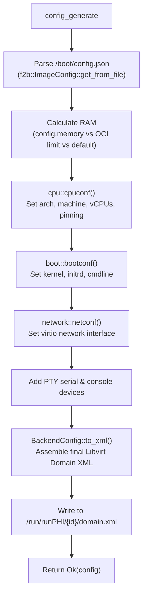
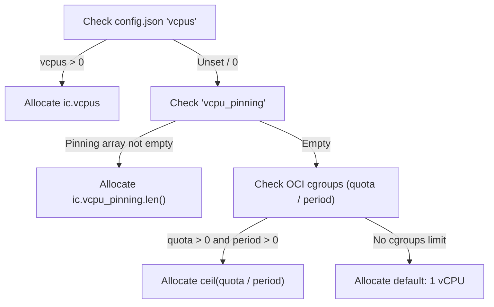
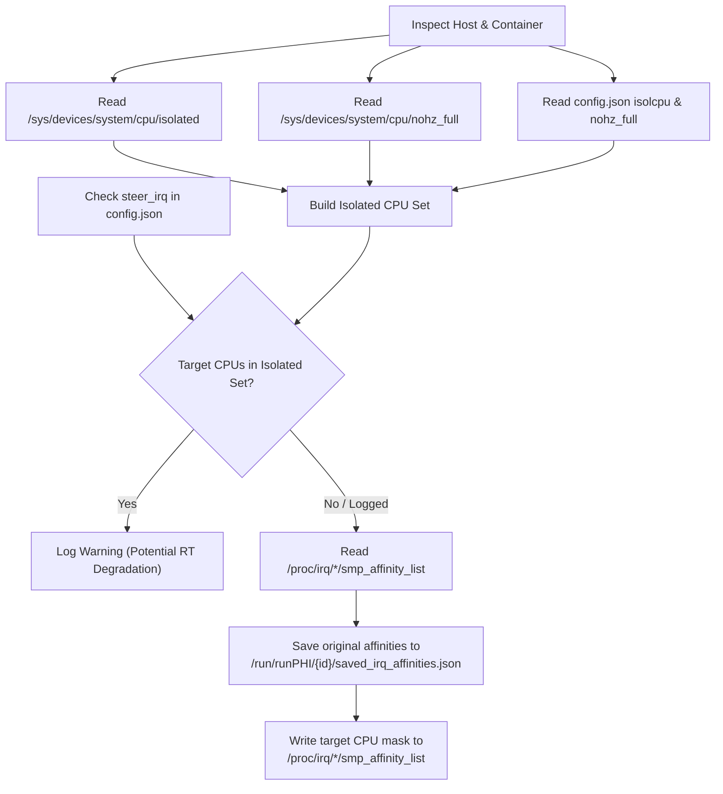

# runPHI KVM Backend — Config Generator Deep Dive

This document details the internal architecture and operation of the **`configGenerator`** module within `crates/backend_kvm`. It describes how runPHI transforms container configurations (`/boot/config.json` and OCI runtime specifications) into Libvirt Domain XML definitions that configure QEMU and KVM.

---

## 1. Module Architecture Overview

The `configGenerator` module synthesizes the hypervisor-level configuration. In the KVM backend, this produces a complete Libvirt Domain XML file written to `/run/runPHI/<containerid>/domain.xml`.

```
crates/backend_kvm/src/
├── configGenerator.rs       # Top-level orchestration & Domain XML assembly
├── configGenerator/
│   ├── boot.rs              # Kernel, initramfs, DTB, and cmdline arguments
│   ├── cpu.rs               # Architecture, machine type, vCPUs, pinning, and KVM/TCG mode
│   ├── disk.rs              # Block device / storage configuration
│   └── network.rs           # Virtual NIC definitions (SLIRP, Bridge, Libvirt network)
└── irq.rs                   # Host CPU isolation detection and IRQ affinity steering
```

### The `BackendConfig` Data Structure

At the center of configuration generation is the `BackendConfig` struct (`configGenerator.rs`):

```rust
#[derive(Debug, Default)]
pub struct BackendConfig {
    pub domain_type: String,      // "kvm" (hardware-accelerated) or "qemu" (TCG software emulation)
    pub name: String,             // Domain name ("runphi-<containerid>")
    pub memory_kib: u64,          // Total RAM in KiB (required by Libvirt)
    pub vcpus: u32,               // Number of vCPUs allocated
    pub cputune_xml: String,      // <cputune> XML block containing <vcpupin> elements
    pub cpu_xml: String,          // <cpu mode='...'> XML block
    pub os_arch: String,          // "x86_64" or "aarch64"
    pub os_machine: String,       // Machine model ("q35" for x86, "virt" for ARM)
    pub os_boot_xml: String,      // Boot elements: <kernel>, <initrd>, <cmdline>, <dtb>
    pub features_xml: String,     // Architectural features: <acpi/>, <apic/>, <gic/>
    pub devices_xml: Vec<String>, // Attached devices: virtio-net, serial, console
    pub xml_file: PathBuf,        // Output path (/run/runPHI/<id>/domain.xml)
}
```

### The `config_generate` Pipeline

The entry point is `configGenerator::config_generate(fc: &f2b::FrontendConfig)`. Its workflow is as follows:



1. **Parse Boot Config**: Reads `/boot/config.json` from the container's mounted rootfs (`fc.mountpoint`). Resolves all file paths relative to rootfs.
2. **Compute RAM Allocation**:
   - Checks `config.memory` (in MB).
   - If `0`, inspects the OCI spec limit: `fc.jsonconfig["linux"]["resources"]["memory"]["limit"]` (converted from bytes to MB).
   - Falls back to built-in defaults: **1024 MB** for Linux guests, **32 MB** for bare-metal/inmate guests.
   - Converts final MB to KiB (`* 1024`) for Libvirt.
3. **Dispatch Submodules**: Calls `cpu::cpuconf`, `boot::bootconf`, and `network::netconf`.
4. **Append Essential System Devices**:
   - PTY Serial device: `<serial type='pty'><target type='isa-serial' port='0'/></serial>`
   - Primary Console: `<console type='pty'><target type='serial' port='0'/></console>`
5. **Serialize to XML**: Calls `BackendConfig::to_xml()` and writes the file.

---

## 2. Submodule Reference

### 2.1 CPU & Machine Configuration (`cpu.rs`)

The `cpu.rs` module configures CPU topologies, hardware virtualization modes, and real-time core affinities.

#### Architecture and Virtualization Detection

The module conditionally compiles rules for `x86_64` and `aarch64`:

| Setting | `x86_64` | `aarch64` |
|---|---|---|
| **Machine Model** (`os_machine`) | `q35` | `virt` |
| **Hardware Features** (`features_xml`) | `<acpi/>`<br/>`<apic/>` | `<gic version='3'/>` |
| **With `/dev/kvm` Available** | `domain_type = "kvm"`<br/>`<cpu mode='host-passthrough' check='none'/>` | `domain_type = "kvm"`<br/>`<cpu mode='host-passthrough' check='none'/>` |
| **Without `/dev/kvm` (Fallback)** | `domain_type = "qemu"`<br/>`<cpu mode='custom'><model>qemu64</model></cpu>` | `domain_type = "qemu"`<br/>`<cpu mode='custom'><model>max</model></cpu>` |

#### vCPU Sizing Hierarchy

`cpuconf` derives the number of allocated virtual CPUs through this priority order:



> **_NOTE:_**
> If a user allocates more vCPUs in `/boot/config.json` than the container's OCI cgroup CPU quota allows, runPHI logs an informative warning:
> `runPHI is allocating X vCPUs, but the container has a limit of Y CPUs (quota: Z)`

#### vCPU Pinning (`<cputune>`)

When `vcpu_pinning` is defined in `/boot/config.json`:
```json
"vcpu_pinning": [
  { "vcpu": 0, "pcpu": 2 },
  { "vcpu": 1, "pcpu": 3 }
]
```

`cpu.rs` generates a `<cputune>` block enforcing static CPU affinity on the host:
```xml
<cputune>
  <vcpupin vcpu='0' cpuset='2'/>
  <vcpupin vcpu='1' cpuset='3'/>
</cputune>
```

---

### 2.2 Boot & Kernel Configuration (`boot.rs`)

The `boot.rs` module sets up direct kernel boot. It differentiates between full Linux operating systems and bare-metal payloads (Zephyr RTOS, unikernels, or standalone ELF binaries).

#### Linux Guest (`os_var: "linux"`)
For Linux guests, runPHI injects the kernel image and initramfs directly into QEMU:
- `<kernel>`: Path to the kernel image (`inmate`, e.g. `/boot/Image`).
- `<initrd>`: Path to the initramfs (`ramdisk`, e.g. `/boot/rootfs.cpio.gz`).
- `<dtb>`: Optional path to an ARM Device Tree Blob (if specified by `dtb`).
- `<cmdline>`: Kernel command-line parameters:
  - **With Virtual Disk** (`disk_type` is `"file"` or `"lvm"`):
    `console=ttyS0,115200 root=/dev/vda rw`
  - **With Initramfs / RAM root**:
    `console=ttyS0,115200`

#### Bare-Metal / Unikernel Guest (`os_var != "linux"`)
For non-Linux payloads (e.g. `os_var: "zephyr"`):
- Emits only the `<kernel>` tag pointing to the ELF or raw binary (`inmate`).
- Omits `<initrd>`, `<cmdline>`, and `<dtb>`.

---

### 2.3 Network Configuration (`network.rs`)

The `network.rs` module manages guest virtual network interfaces, supporting multiple modes selected via the `"net"` and `"netconf"` fields.

#### Truthy vs. Falsy Evaluation
`is_net_enabled(net_val)` checks if networking is disabled. The following values disable networking:
`""`, `"no"`, `"none"`, `"false"`, `"off"`, `"disabled"`, `"0"` (case-insensitive).
Any other value enables networking.

#### Supported Network Modes

| Configuration (`"net"`) | Output Libvirt XML | Description |
|---|---|---|
| `"user"` or `"slirp"` | `<interface type='user'><model type='virtio'/></interface>` | QEMU User-mode (SLIRP) NAT networking. Fully isolated, requires no host bridges or root privileges. |
| `"bridge:<name>"` | `<interface type='bridge'><source bridge='<name>'/><model type='virtio'/></interface>` | Attaches guest virtio-net directly to the specified host bridge. |
| `"bridge"` | `<interface type='bridge'><source bridge='...'/><model type='virtio'/></interface>` | Uses `"netconf"` if provided; otherwise automatically detects candidate bridges on the host (`virbr0`, `docker0`, `xenbr0`, `br0`). |
| `"network:<name>"` | `<interface type='network'><source network='<name>'/><model type='virtio'/></interface>` | Connects to a managed Libvirt virtual network (e.g. `<source network='default'/>`). |
| Host Bridge Name (e.g. `"docker0"`) | `<interface type='bridge'><source bridge='docker0'/><model type='virtio'/></interface>` | If `/sys/class/net/<name>` exists, connects directly to that bridge. |
| Default (`"yes"` or `"true"`) | Smart Auto-Detection | 1. If `virtnetworkd-sock` exists: uses Libvirt network `default`.<br/>2. If host bridge detected: uses bridge.<br/>3. Fallback: User-mode SLIRP. |

---

### 2.4 Storage & Disk Management (`disk.rs`)

The `disk.rs` module defines storage attachments.

#### Architectural Design
1. **File-Backed Disk (`disk_type: "file"`)**:
   - A raw ext4 disk image is bundled inside the container rootfs (e.g. `/boot/rootfs.img`).
   - Attached as a virtio block device (`<disk type='file' device='disk'>`).
   - Guest writes land in the container's writable storage layer.
2. **Host LVM Disk (`disk_type: "lvm"`)**:
   - A dedicated Logical Volume (`/dev/<vg>/lv_<containerid>`) is created at `create` time.
   - Formatted with `mkfs.ext4` and populated with a clone of the container's rootfs.
   - Attached as a raw block device (`<disk type='block' device='disk'>`).
   - Automatically removed at container deletion (`destroyguest`).

> [!NOTE]
> In current production releases of `backend_kvm`, guests primarily boot using direct kernel + initramfs (`ramdisk`) in RAM. The LVM and file-disk provisioning pipeline is currently undergoing consolidation with the Libvirt Domain XML builder.

---

### 2.5 Interrupt Steering Subsystem (`irq.rs`)

The `irq.rs` module protects isolated real-time vCPUs from non-real-time host hardware interrupts.



#### Key Functions
- `parse_cpulist(s: &str) -> HashSet<usize>`: Parses cpulist strings like `"0"`, `"1,2"`, `"1-3,5"`.
- `get_isolated_cpus(ic: &f2b::ImageConfig) -> HashSet<usize>`: Reads sysfs isolation files and container metadata.
- `warn_if_isolated(steer_cpus: &[usize], ic: &f2b::ImageConfig)`: Alerts the operator if target interrupt cores are marked as isolated.
- `apply_irq_steering(crundir, ic, steer_cpus)`: Rewrites `/proc/irq/*/smp_affinity_list` and preserves original settings.
- `restore_irq_steering(crundir)`: Restores original affinities when the container is destroyed.

---

## 3. Generated Domain XML Example

Here is a complete Libvirt Domain XML document generated by `configGenerator` for an x86_64 real-time Linux container with vCPU pinning and SLIRP networking:

```xml
<domain type='kvm'>
  <name>runphi-container12345678901234</name>
  <memory unit='KiB'>1048576</memory>
  <vcpu placement='static'>2</vcpu>
  <cputune>
    <vcpupin vcpu='0' cpuset='2'/>
    <vcpupin vcpu='1' cpuset='3'/>
  </cputune>
  <os>
    <type arch='x86_64' machine='q35'>hvm</type>
    <kernel>/var/lib/docker/overlay2/.../merged/boot/Image</kernel>
    <initrd>/var/lib/docker/overlay2/.../merged/boot/rootfs.cpio.gz</initrd>
    <cmdline>console=ttyS0,115200</cmdline>
  </os>
  <features>
    <acpi/>
    <apic/>
  </features>
  <cpu mode='host-passthrough' check='none'/>
  <seclabel type='static' model='dac' relabel='no'>
    <label>root:root</label>
  </seclabel>
  <on_poweroff>destroy</on_poweroff>
  <on_reboot>destroy</on_reboot>
  <on_crash>destroy</on_crash>
  <devices>
    <emulator>/usr/bin/qemu-system-x86_64</emulator>
    <interface type='user'>
      <model type='virtio'/>
    </interface>
    <serial type='pty'>
      <target type='isa-serial' port='0'/>
    </serial>
    <console type='pty'>
      <target type='serial' port='0'/>
    </console>
  </devices>
</domain>
```

---

Proceed to **[Container Boot Config Reference (`/boot/config.json`)](config_json_reference.md)** to see how to define your container workloads.
